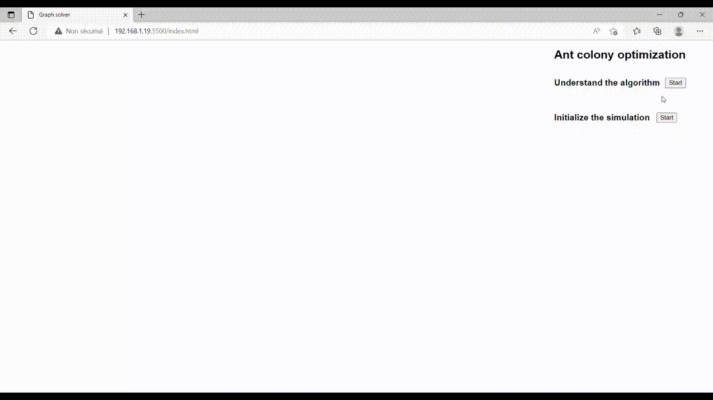

## Solving salesman problem using Ant colony optimization (ACO) metaheuristic

This is a simulation of ACO algorithm. The visualization is intented to demonstrate how ACO works and how to solve a particuler problem, Travelling salesman problem in this case.

### Travelling salesman problem TSP description
Given a list of cities and the distances between each pair of cities, what is the shortest possible route that visits each city exactly once and returns to the origin city?

It is a well known problem taking part in NP-hard category in combinatorial optimization, important in theoretical computer science and operations research.

### This work
This is my way of implementing ACO algorithm and drawing its steps on a HTML canvas using JAVASCRIPT.

## This project will guide you through understanding the algorithm 

## And also offering the possibility to run it with your own values
